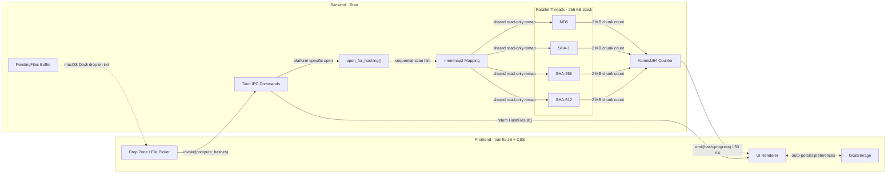

<p align="center"></p>

<h1 align="center">Hasher</h1>

<p align="center"><strong>Fast, lightweight file hash checker built with Tauri 2 + Rust</strong></p>

<p align="center">
  <a href="https://github.com/yuman07/Hasher/releases"></a>
  <a href="https://github.com/yuman07/Hasher/releases"></a>
  <a href="https://github.com/yuman07/Hasher/stargazers"></a>
  <br>
  
  
  
  <a href="https://github.com/yuman07/Hasher/blob/main/LICENSE"></a>
</p>

<p align="center">
  <a href="README.md">English</a> | <a href="README_ZH.md">中文</a>
</p>

---

## What is Hasher?

Hasher is a desktop application that computes cryptographic file hashes instantly. Drop any file into the window and get MD5, SHA-1, SHA-256, and SHA-512 checksums — useful for verifying downloads, comparing files, or checking data integrity. Built with Tauri 2 and Rust for minimal resource usage (~2.3 MB binary).

## Features

- **Multiple algorithms** — MD5 / SHA-1 / SHA-256 / SHA-512, toggle any combination in settings
- **Hash verification** — paste an expected hash, algorithm auto-detected by length; the matching row is highlighted green, mismatches flagged in red
- **Drag & drop or click** — drop files into the window or click to open a file picker
- **Batch processing** — handle multiple files at once with real-time progress bars
- **Parallel & fast** — one thread per algorithm, memory-mapped I/O, ~2.3 MB binary
- **Dark / Light mode** — follows system preference and updates live when the OS theme changes
- **Chinese / English** — auto-detects system locale and updates live when the OS language changes
- **One-click copy** — copies `SHA-256: abc123...` to clipboard
- **File type icons** — color-coded by category
- **Collapse / expand** — per-card and global toggle
- **macOS Dock drop** — drop files on Dock icon to hash (cold start supported)

<p align="center">
  
  
</p>
<p align="center">
  
  
</p>

## Install

### macOS (15.0 Sequoia+, Apple Silicon)

#### Option 1 — Quick install (recommended)

```bash
curl -fsSL https://raw.githubusercontent.com/yuman07/Hasher/main/install.sh | bash
```

The script automatically downloads the latest version, installs it to `/Applications`, and removes the quarantine flag so it opens without issues.

#### Option 2 — Manual install

Download the `.dmg` from [Releases](https://github.com/yuman07/Hasher/releases/latest), open it, and drag `Hasher.app` to Applications.

> **Note:** This app is not signed with an Apple Developer certificate. macOS Gatekeeper will block it on first launch with a message like *"Hasher.app can't be opened because Apple cannot check it for malicious software"*. To fix this, choose **one** of the following methods after installing:
>
> **Method 1 — System Settings (easiest):**
> 1. Try to open Hasher — it will be blocked
> 2. Go to **System Settings > Privacy & Security**
> 3. Scroll down to the Security section, you'll see a message about Hasher being blocked
> 4. Click **"Open Anyway"**, then confirm in the dialog
>
> **Method 2 — Right-click:**
> 1. In Finder, right-click (or Control-click) on `Hasher.app`
> 2. Select **"Open"** from the context menu
> 3. Click **"Open"** in the dialog that appears
>
> **Method 3 — Terminal:**
> ```bash
> xattr -cr /Applications/Hasher.app
> ```
>
> You only need to do this once. After the first successful launch, macOS will remember your choice.

### Windows (10+, x64)

Download `Hasher_Win10_x64_<version>.exe` from [Releases](https://github.com/yuman07/Hasher/releases/latest) — portable, no install needed.

> **Note:** This app is not code-signed. Windows SmartScreen may show a warning saying *"Windows protected your PC"* on first launch. Click **"More info"** then **"Run anyway"** to proceed. This only happens once.

## Development

> Only macOS build steps are provided.

**Prerequisites — two tiers:**

| Tool | Theoretical minimum (no guarantee) | Recommended (verified on author's machine) |
|:---|:---|:---|
| macOS | 15.0 Sequoia, Apple Silicon | 26.4.1 Tahoe, Apple Silicon |
| Xcode Command Line Tools | 16.0 (ships macOS 15 SDK) | 26.4.1 |
| Rust | 1.85 | 1.95.0 |
| Node.js | 20.19 or 22.12 | 24.14.0 |

**Theoretical minimum** — derived from the repo's source and config:

- **macOS 15.0** — `src-tauri/tauri.conf.json` pins `minimumSystemVersion: "15.0"` as the deployment target; the build host cannot be older than the deployment target.
- **Xcode CLT 16.0** — first CLT release that ships the macOS 15 SDK (see https://developer.apple.com/xcode/system-requirements/).
- **Rust 1.85** — required by `edition = "2024"` in `src-tauri/Cargo.toml`.
- **Node.js 20.19 / 22.12** — `engines` constraint declared by Vite 8 in `package-lock.json`.

These bounds have **not been regression-tested**; using the minimum versions is not guaranteed to build or run successfully.

**Recommended** — the combination currently used by the author for dev and release builds, verified to work end-to-end. If you want a zero-friction setup, match these versions.

```bash
# 1. Install Xcode Command Line Tools (provides C/C++ compiler required by Rust and Tauri)
xcode-select --install

# 2. Install Devbox (manages Rust & Node.js automatically)
curl -fsSL https://get.jetify.com/devbox | bash

# 3. Clone the repository and enter the project directory
git clone https://github.com/yuman07/Hasher.git
cd Hasher

# 4. Install frontend dependencies
devbox run -- npm install

# 5. Run in dev mode or build for release
devbox run -- npx tauri dev       # dev mode
devbox run -- npx tauri build     # release build
```

## Technical Overview

Hasher is a [Tauri 2](https://tauri.app/) hybrid app — a Rust backend handles all file I/O and cryptographic computation, while a vanilla JS frontend manages the UI. The two sides communicate through Tauri's IPC bridge: the frontend `invoke()`s Rust commands, and the backend `emit()`s events back.

### How hashing works

When files are dropped (or selected), the frontend calls the `compute_hashes` command for each file. The backend then:

1. **Opens the file** with platform-specific sequential-read hints (`FILE_FLAG_SEQUENTIAL_SCAN` on Windows, `madvise(SEQUENTIAL)` on Unix) to tell the OS to prefetch aggressively and release pages early.
2. **Memory-maps the file** via `memmap2` — zero user-space buffering, the OS page cache serves data directly to the hash functions.
3. **Spawns one OS thread per selected algorithm** (up to 4). All threads share the same read-only mmap, so the file is only mapped once regardless of how many algorithms run. Each thread has a 256 KB stack (hash state needs < 2 KB; the platform default of 512 KB–8 MB would be wasteful).
4. **Tracks progress** with a single `AtomicU64` counter. Every thread bumps it after each 2 MB chunk. The calling thread polls this counter every 50 ms and emits a `hash-progress` event to the frontend, which updates the progress bar.
5. **Returns results** once all threads finish. Hex encoding uses a precomputed lookup table for speed.

Empty files are fast-pathed — their well-known hashes are computed inline without threads or mmap.

### Frontend design

The frontend is zero-framework vanilla JS + CSS to keep the binary small (~2.3 MB total). Key design choices:

- **i18n** — a flat `messages` object with `en`/`zh` keys; UI language is chosen from `navigator.language` at launch, and a `languagechange` listener re-renders the UI live if the OS locale changes.
- **Theming** — CSS variables drive light/dark mode. A synchronous `<script>` in `<head>` reads `prefers-color-scheme` before first paint to prevent flash; a `matchMedia` listener then applies OS theme changes live with a 350 ms CSS transition.
- **Hash verification** — each card has an expected-hash input; the value is normalized (strips `algo:` prefixes and whitespace), length-mapped to MD5/SHA-1/SHA-256/SHA-512, and compared against the already-computed rows. Runs on every keystroke and again once results render, so pasting before the hash finishes still works.
- **State** — a single `state` object holds the file map, settings, language, and theme. Only algorithm selection and hash case persist to `localStorage`; language and theme are always derived from the OS — resolved at launch and kept in sync via `languagechange` / `matchMedia` listeners.
- **macOS Dock drop** — on macOS, files dropped onto the Dock icon fire a Tauri `RunEvent::Opened`. If the frontend isn't ready yet (cold start), paths are buffered in a `Mutex<Vec<String>>` on the Rust side; the frontend calls `take_pending_files` on init to retrieve them.

### Tech stack

| Component | Technology |
|:---|:---|
| **Framework** | [Tauri 2](https://tauri.app/) |
| **Backend** | Rust — md-5, sha1, sha2, memmap2 |
| **Frontend** | Vanilla JS + CSS (zero framework) |
| **Build** | Vite 8 |
| **Runtime** | Node.js 24 |

### Architecture



- **Main data flow** — user drops files into the Drop Zone, which `invoke()`s the Rust backend. The backend opens the file with OS-level sequential hints, memory-maps it once, and fans out to parallel hash threads. Progress flows back to the UI via 50 ms event polling; final results are returned as `HashResult[]`
- **Shared mmap design** — all hash threads read from the same read-only memory mapping. This means a 1 GB file is mapped once (not 4 times), and the OS page cache serves every algorithm without redundant I/O
- **Dock drop buffer** — the `PendingFiles` mutex handles the race condition where macOS delivers `RunEvent::Opened` before the frontend webview is ready. Paths are buffered in Rust and drained by the frontend on init via `take_pending_files()`
- **Preference persistence** — algorithm selection and hash case are stored in `localStorage` and restored on every launch; theme and language are driven by the OS — resolved at launch and updated live via `prefers-color-scheme` / `languagechange` listeners, decoupled from the Rust backend

### Project structure

```
Hasher/
|-- .github/
|   `-- workflows/
|       `-- release.yml         # CI: build macOS & Windows on release
|-- src/                        # Frontend
|   |-- main.js                 # App logic, i18n, UI rendering
|   `-- styles.css              # Themes, layout, animations
|-- src-tauri/
|   |-- src/
|   |   |-- main.rs             # Entry point
|   |   `-- lib.rs              # Hashing engine, IPC commands
|   |-- icons/                  # App icons (icns, ico, png)
|   |-- Info.plist              # macOS metadata
|   |-- Cargo.toml              # Rust dependencies
|   `-- tauri.conf.json         # Tauri config (window, bundle)
|-- index.html                  # HTML shell with embedded SVG icons
|-- vite.config.js              # Vite dev server config
|-- package.json                # Frontend dependencies
|-- devbox.json                 # Devbox environment (Rust, Node.js)
|-- build-meta.json             # Windows build naming metadata
|-- install.sh                  # macOS one-click install script
`-- rust-toolchain.toml         # Rust stable channel pin
```

## License

[MIT](LICENSE)
