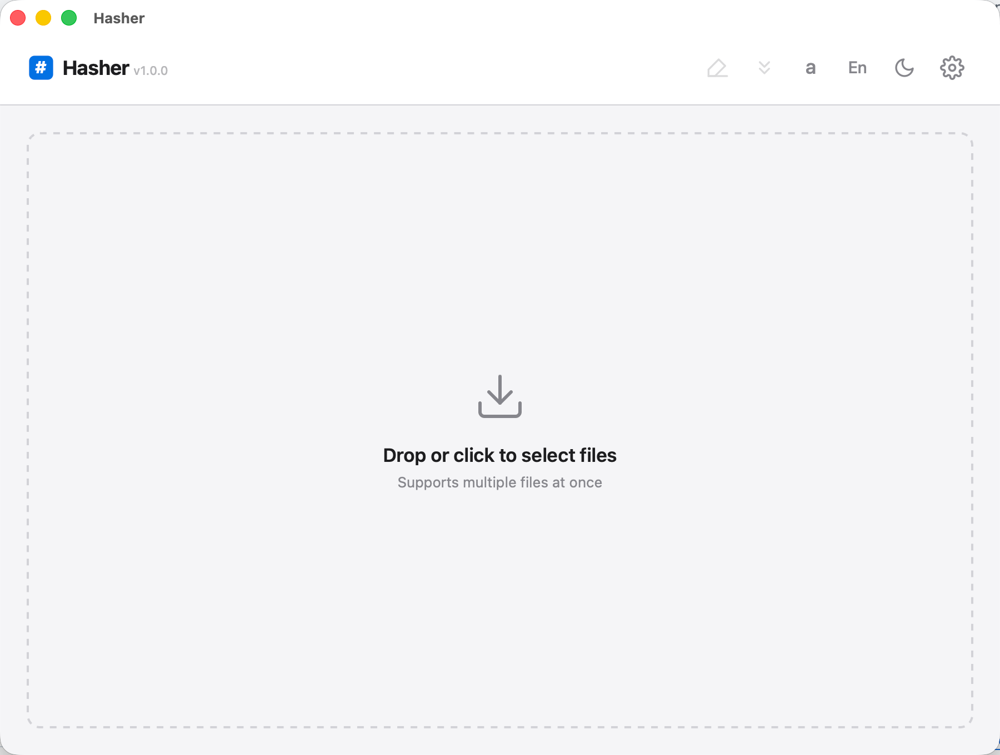
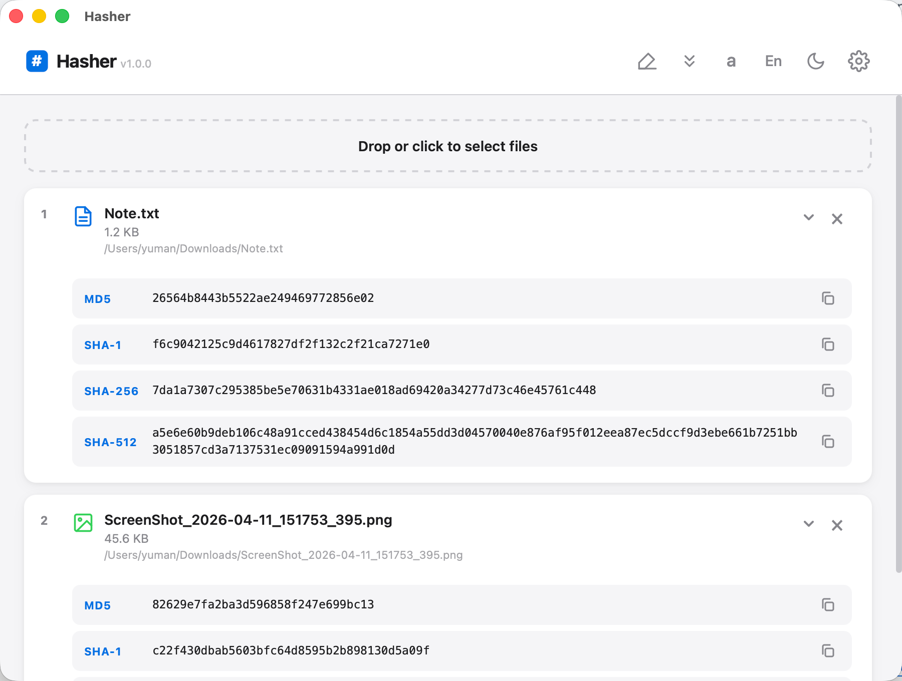
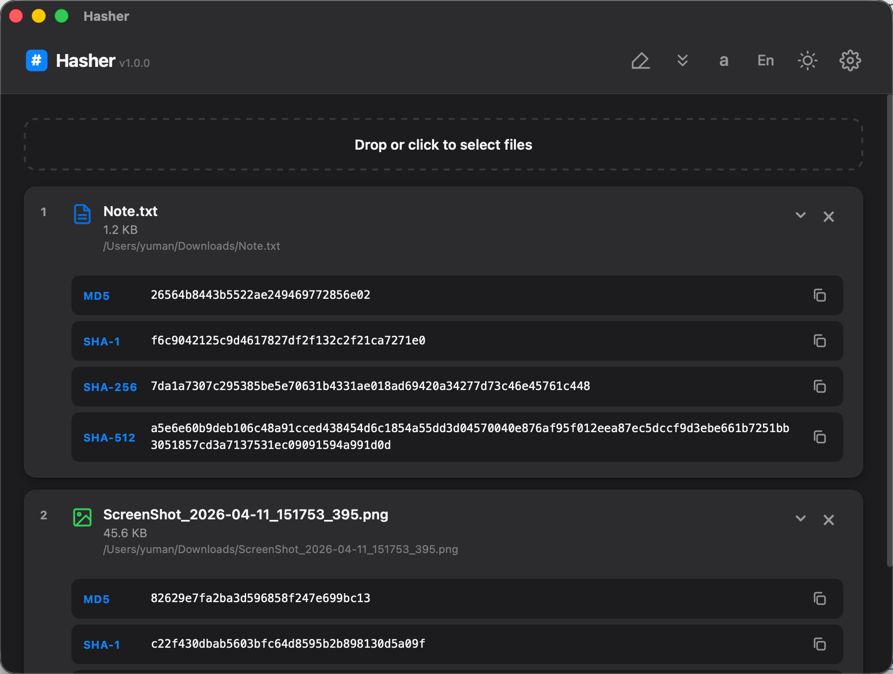
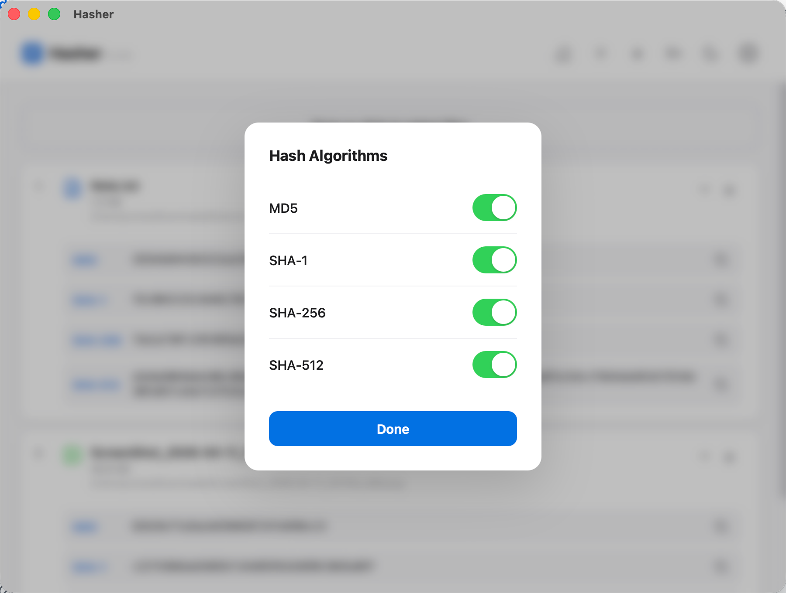

<p align="center"></p>

<h1 align="center">Hasher</h1>

<p align="center"><strong>基于 Tauri 2 + Rust 构建的快速、轻量级文件哈希校验工具</strong></p>

<p align="center">
  <a href="https://github.com/yuman07/Hasher/releases"></a>
  <a href="https://github.com/yuman07/Hasher/releases"></a>
  <a href="https://github.com/yuman07/Hasher/stargazers"></a>
  <br>
  
  
  
  <a href="https://github.com/yuman07/Hasher/blob/main/LICENSE"></a>
</p>

<p align="center">
  <a href="README.md">English</a> | <a href="README_ZH.md">中文</a>
</p>

---

## Hasher 是什么？

Hasher 是一款桌面端文件哈希校验工具。将文件拖入窗口即可立即获取 MD5、SHA-1、SHA-256、SHA-512 校验值——适用于验证下载文件、比对文件一致性或检查数据完整性。基于 Tauri 2 和 Rust 构建，资源占用极低（应用仅约 2.3 MB）。

## 功能特性

- **多种哈希算法** — MD5 / SHA-1 / SHA-256 / SHA-512，可在设置中自由组合
- **拖放或点击选择** — 文件拖入窗口，或点击虚线区域打开文件选择器
- **批量处理** — 同时处理多个文件，每个文件有实时进度条
- **并行高性能** — 每种算法独立线程，内存映射 I/O，应用仅约 2.3 MB
- **深色 / 浅色模式** — 跟随系统偏好，切换带平滑过渡动画
- **中文 / 英文** — 自动检测系统语言
- **一键复制** — 点击即复制 `SHA-256: abc123...` 到剪贴板
- **文件类型图标** — 按类型着色区分
- **折叠 / 展开** — 支持单个卡片和全局折叠
- **macOS Dock 拖放** — 拖文件到 Dock 图标直接计算（支持冷启动）

<p align="center">
  
  
</p>
<p align="center">
  
  
</p>

## 安装

### macOS（15.0 Sequoia+，Apple Silicon）

#### 方式一 — 一键安装（推荐）

```bash
curl -fsSL https://raw.githubusercontent.com/yuman07/Hasher/main/install.sh | bash
```

脚本会自动下载最新版本、安装到 `/Applications` 并移除隔离标记，打开即用，无需额外操作。

#### 方式二 — 手动安装

从 [Releases](https://github.com/yuman07/Hasher/releases/latest) 下载 `.dmg` 文件，打开后将 `Hasher.app` 拖入「应用程序」文件夹。

> **注意：** 本应用没有 Apple 开发者签名。首次打开时 macOS Gatekeeper 会拦截，提示 *「无法打开"Hasher.app"，因为 Apple 无法检查其是否包含恶意软件」*。请选择以下**任一方法**解决：
>
> **方法一 — 系统设置（最简单）：**
> 1. 尝试打开 Hasher — 会被拦截
> 2. 打开**系统设置 > 隐私与安全性**
> 3. 向下滚动到「安全性」部分，会看到关于 Hasher 被阻止的提示
> 4. 点击**「仍要打开」**，在弹出的对话框中确认
>
> **方法二 — 右键打开：**
> 1. 在访达中，右键点击（或 Control + 点击）`Hasher.app`
> 2. 选择**「打开」**
> 3. 在弹出的对话框中点击**「打开」**
>
> **方法三 — 终端命令：**
> ```bash
> xattr -cr /Applications/Hasher.app
> ```
>
> 以上操作只需执行一次，之后即可正常打开。

### Windows（10+，x64）

从 [Releases](https://github.com/yuman07/Hasher/releases/latest) 下载 `Hasher_Win10_x64_<version>.exe` — 免安装，双击即用。

> **注意：** 本应用没有代码签名。首次运行时 Windows SmartScreen 可能会弹出 *「Windows 已保护你的电脑」* 警告。点击**「更多信息」**然后点击**「仍要运行」**即可。此操作只需一次。

## 开发

> 以下仅提供 macOS 构建步骤。

**前置要求：**

- macOS 15.6 Sequoia 或更高版本（Apple Silicon）
- Xcode Command Line Tools 26.0 或更高版本

```bash
# 1. 安装 Xcode Command Line Tools（提供 Rust 和 Tauri 所需的 C/C++ 编译器）
xcode-select --install

# 2. 安装 Devbox（自动管理 Rust 和 Node.js）
curl -fsSL https://get.jetify.com/devbox | bash

# 3. 克隆仓库并进入项目目录
git clone https://github.com/yuman07/Hasher.git
cd Hasher

# 4. 安装前端依赖
devbox run -- npm install

# 5. 运行开发模式或构建发布版
devbox run -- npx tauri dev       # 开发模式
devbox run -- npx tauri build     # 构建发布版
```

## 技术概览

| 组件 | 技术 |
|:---|:---|
| **框架** | [Tauri 2](https://tauri.app/) |
| **后端** | Rust — md-5, sha1, sha2, memmap2 |
| **前端** | 原生 JS + CSS（零框架） |
| **构建** | Vite 8 |
| **运行时** | Node.js 24 |

```
  前端 (JS)                              后端 (Rust)
  ────────                               ──────────
  拖放 / 选择文件      ──invoke──>       open_for_hashing()
                                           │
  监听进度事件         <──emit───        mmap 映射文件
  更新 UI                                  │
                                         每种算法一个线程：
                                           ├─ MD5    ─┐
                                           ├─ SHA-1  ─┤ AtomicU64
                                           ├─ SHA-256 ┤ 进度计数器
                                           └─ SHA-512 ┘
                                           │
  接收结果             <──return──       收集 hex 结果
```

```
Hasher/
├── src/                    # 前端
│   ├── main.js             # 应用逻辑、国际化、UI 渲染
│   └── styles.css          # 主题、布局、动画
├── src-tauri/
│   ├── src/
│   │   ├── main.rs         # 入口
│   │   └── lib.rs          # 哈希引擎、IPC 命令
│   ├── icons/              # 应用图标（icns、ico、png）
│   ├── Info.plist          # macOS 元数据
│   ├── Cargo.toml          # Rust 依赖
│   └── tauri.conf.json     # Tauri 配置（窗口、打包）
├── index.html              # HTML 入口，内嵌 SVG 图标
├── vite.config.js          # Vite 开发服务器配置
├── package.json            # 前端依赖
├── devbox.json             # Devbox 环境（Rust、Node.js）
├── build-meta.json         # Windows 构建命名元数据
├── install.sh              # macOS 一键安装脚本
└── rust-toolchain.toml     # Rust stable 版本锁定
```

## 许可证

[MIT](LICENSE)
