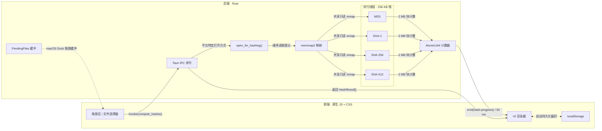

<p align="center"></p>

<h1 align="center">Hasher</h1>

<p align="center"><strong>基于 Tauri 2 + Rust 构建的快速、轻量级文件哈希校验工具</strong></p>

<p align="center">
  <a href="https://github.com/yuman07/Hasher/releases"></a>
  <a href="https://github.com/yuman07/Hasher/releases"></a>
  <a href="https://github.com/yuman07/Hasher/stargazers"></a>
  <br>
  
  
  
  <a href="https://github.com/yuman07/Hasher/blob/main/LICENSE"></a>
</p>

<p align="center">
  <a href="README.md">English</a> | <a href="README_ZH.md">中文</a>
</p>

---

## Hasher 是什么？

Hasher 是一款桌面端文件哈希校验工具。将文件拖入窗口即可立即获取 MD5、SHA-1、SHA-256、SHA-512 校验值——适用于验证下载文件、比对文件一致性或检查数据完整性。基于 Tauri 2 和 Rust 构建，资源占用极低（应用仅约 2.3 MB）。

## 功能特性

- **多种哈希算法** — MD5 / SHA-1 / SHA-256 / SHA-512，可在设置中自由组合
- **哈希校验** — 粘贴期望哈希值，按长度自动识别算法；匹配的哈希行高亮绿色，不匹配则红色提示
- **拖放或点击选择** — 文件拖入窗口，或点击虚线区域打开文件选择器
- **批量处理** — 同时处理多个文件，每个文件有实时进度条
- **并行高性能** — 每种算法独立线程，内存映射 I/O，应用仅约 2.3 MB
- **深色 / 浅色模式** — 跟随系统偏好，随系统主题实时切换并带过渡动画
- **中文 / 英文** — 自动检测系统语言，系统语言切换时实时更新界面
- **一键复制** — 点击即复制 `SHA-256: abc123...` 到剪贴板
- **文件类型图标** — 按类型着色区分
- **折叠 / 展开** — 支持单个卡片和全局折叠
- **macOS Dock 拖放** — 拖文件到 Dock 图标直接计算（支持冷启动）

<p align="center">
  
  
</p>
<p align="center">
  
  
</p>

## 安装

### macOS（15.0 Sequoia+，Apple Silicon）

#### 方式一 — 一键安装（推荐）

```bash
curl -fsSL https://raw.githubusercontent.com/yuman07/Hasher/main/install.sh | bash
```

脚本会自动下载最新版本、安装到 `/Applications` 并移除隔离标记，打开即用，无需额外操作。

#### 方式二 — 手动安装

从 [Releases](https://github.com/yuman07/Hasher/releases/latest) 下载 `.dmg` 文件，打开后将 `Hasher.app` 拖入「应用程序」文件夹。

> **注意：** 本应用没有 Apple 开发者签名。首次打开时 macOS Gatekeeper 会拦截，提示 *「无法打开"Hasher.app"，因为 Apple 无法检查其是否包含恶意软件」*。请选择以下**任一方法**解决：
>
> **方法一 — 系统设置（最简单）：**
> 1. 尝试打开 Hasher — 会被拦截
> 2. 打开**系统设置 > 隐私与安全性**
> 3. 向下滚动到「安全性」部分，会看到关于 Hasher 被阻止的提示
> 4. 点击**「仍要打开」**，在弹出的对话框中确认
>
> **方法二 — 右键打开：**
> 1. 在访达中，右键点击（或 Control + 点击）`Hasher.app`
> 2. 选择**「打开」**
> 3. 在弹出的对话框中点击**「打开」**
>
> **方法三 — 终端命令：**
> ```bash
> xattr -cr /Applications/Hasher.app
> ```
>
> 以上操作只需执行一次，之后即可正常打开。

### Windows（10+，x64）

从 [Releases](https://github.com/yuman07/Hasher/releases/latest) 下载 `Hasher_Win10_x64_<version>.exe` — 免安装，双击即用。

> **注意：** 本应用没有代码签名。首次运行时 Windows SmartScreen 可能会弹出 *「Windows 已保护你的电脑」* 警告。点击**「更多信息」**然后点击**「仍要运行」**即可。此操作只需一次。

## 开发

> 以下仅提供 macOS 构建步骤。

### 推荐前置要求

Rust 和 Node.js 不在表里——Devbox 会在首次构建时自动装好。

| 依赖 | 推荐版本 |
|:---|:---|
| macOS | 26.4.1 Tahoe，Apple Silicon |
| Xcode Command Line Tools | 26.4.1 |
| Devbox | 0.17.1 |

<sub>以上是作者当前的开发环境版本，已在 dev 与发布构建中验证可用。更低版本或许也能运行，但未经测试，对其效果不做保证。</sub>

### 如何确认满足前置要求

对照上表，逐项检查本机是否满足；未满足时按给出的步骤安装或升级。

- **macOS**
  - *检查*：终端执行 `sw_vers`，或打开**系统设置 → 通用 → 关于本机**。
  - *升级*：**系统设置 → 通用 → 软件更新**（推荐）。必须 Apple Silicon 机型——本应用不支持 Intel Mac，Intel 硬件无法满足此前置条件。
- **Xcode Command Line Tools**
  - *检查*：`xcode-select -p` 打印安装路径（存在即已装）；`pkgutil --pkg-info=com.apple.pkg.CLTools_Executables` 打印已装版本号。
  - *首次安装*：`xcode-select --install`（会弹出 GUI 对话框，从 Apple 服务器下载安装）。
  - *升级*：**系统设置 → 通用 → 软件更新**（推荐），CLT 的更新会跟随 macOS 更新一起出现。
- **Devbox**
  - *检查*：`devbox version`。
  - *首次安装*：`curl -fsSL https://get.jetify.com/devbox | bash`。
  - *升级*：`devbox version update`。

### 构建步骤

假定上述前置都已满足。

```bash
# 1. 克隆仓库并进入项目目录
git clone https://github.com/yuman07/Hasher.git
cd Hasher

# 2. 安装前端依赖
#    （Devbox 首次执行会自动拉取 Rust + Node.js，无需手动处理）
devbox run -- npm install

# 3. 运行开发模式或构建发布版
devbox run -- npx tauri dev       # 开发模式
devbox run -- npx tauri build     # 构建发布版
```

## 技术概览

Hasher 是一个 [Tauri 2](https://tauri.app/) 混合应用——Rust 后端负责所有文件 I/O 和密码学计算，原生 JS 前端负责 UI 渲染。两者通过 Tauri 的 IPC 桥接通信：前端 `invoke()` 调用 Rust 命令，后端 `emit()` 事件回传给前端。

### 哈希计算流程

当文件被拖入（或选择）后，前端为每个文件调用 `compute_hashes` 命令。后端处理流程如下：

1. **打开文件**时附加平台特定的顺序读取提示（Windows 上使用 `FILE_FLAG_SEQUENTIAL_SCAN`，Unix 上使用 `madvise(SEQUENTIAL)`），告知操作系统积极预读并尽早释放页面。
2. **通过 `memmap2` 内存映射文件**——零用户空间缓冲，操作系统页面缓存直接为哈希函数提供数据。
3. **为每种选中的算法启动一个 OS 线程**（最多 4 个）。所有线程共享同一个只读 mmap，无论运行多少种算法，文件只映射一次。每个线程仅分配 256 KB 栈空间（哈希状态实际需要不到 2 KB；平台默认的 512 KB–8 MB 会造成浪费）。
4. **通过单个 `AtomicU64` 计数器追踪进度**。每个线程处理完一个 2 MB 块后累加计数器。调用线程每 50 ms 轮询一次，向前端发送 `hash-progress` 事件更新进度条。
5. **所有线程完成后返回结果**。十六进制编码使用预计算查找表加速。

空文件走快速路径——直接内联计算已知哈希值，无需启动线程或触发 mmap。

### 前端设计

前端采用零框架的原生 JS + CSS，以保持极小的二进制体积（总计约 2.3 MB）。关键设计：

- **国际化** — 一个扁平的 `messages` 对象包含 `en`/`zh` 键值；启动时通过 `navigator.language` 决定界面语言；`languagechange` 监听器在系统语言切换时实时重渲染界面。
- **主题** — CSS 变量驱动明暗模式。`<head>` 中的同步 `<script>` 在首次绘制前读取 `prefers-color-scheme`，避免闪烁；`matchMedia` 监听器随后实时响应系统主题变化，带 350 ms CSS 过渡。
- **哈希校验** — 每张卡片底部有一个期望哈希输入框：输入值经过归一化（剥离 `algo:` 前缀和空白字符）后，按长度映射到 MD5 / SHA-1 / SHA-256 / SHA-512，再与已计算的哈希行比对。每次键入都会校验，结果渲染完毕后也会重跑一次，因此粘贴比哈希算完还快也没问题。
- **状态** — 单个 `state` 对象持有文件映射、设置、语言和主题。仅算法选择和哈希大小写通过 `localStorage` 持久化；语言和主题始终由系统驱动——启动时解析，并通过 `languagechange` / `matchMedia` 监听器保持实时同步。
- **macOS Dock 拖放** — 在 macOS 上，拖放到 Dock 图标的文件触发 Tauri 的 `RunEvent::Opened`。若前端尚未就绪（冷启动），路径会缓存在 Rust 端的 `Mutex<Vec<String>>` 中；前端初始化时调用 `take_pending_files` 取回。

### 技术栈

| 组件 | 技术 |
|:---|:---|
| **框架** | [Tauri 2](https://tauri.app/) |
| **后端** | Rust — md-5, sha1, sha2, memmap2 |
| **前端** | 原生 JS + CSS（零框架） |
| **构建** | Vite 8 |
| **运行时** | Node.js 24 |

### 架构



- **主数据流** — 用户将文件拖入拖放区，前端 `invoke()` 调用 Rust 后端。后端以操作系统级顺序读取提示打开文件、内存映射一次后分发给并行哈希线程。进度通过 50 ms 事件轮询回传 UI；最终结果以 `HashResult[]` 返回
- **共享 mmap 设计** — 所有哈希线程读取同一个只读内存映射。一个 1 GB 的文件只映射一次（而非 4 次），操作系统页面缓存为每种算法提供数据，无冗余 I/O
- **Dock 拖放缓冲** — `PendingFiles` 互斥锁处理 macOS 在前端 webview 就绪前发送 `RunEvent::Opened` 的竞态条件。路径缓存在 Rust 端，前端初始化时通过 `take_pending_files()` 取回
- **偏好持久化** — 算法选择和哈希大小写存储在 `localStorage`，每次启动自动恢复；主题和语言由系统驱动——启动时解析，并通过 `prefers-color-scheme` / `languagechange` 监听器实时更新，与 Rust 后端解耦

### 项目结构

```
Hasher/
|-- .github/
|   `-- workflows/
|       `-- release.yml         # CI：发布时构建 macOS 和 Windows
|-- src/                        # 前端
|   |-- main.js                 # 应用逻辑、国际化、UI 渲染
|   `-- styles.css              # 主题、布局、动画
|-- src-tauri/
|   |-- src/
|   |   |-- main.rs             # 入口
|   |   `-- lib.rs              # 哈希引擎、IPC 命令
|   |-- icons/                  # 应用图标（icns、ico、png）
|   |-- Info.plist              # macOS 元数据
|   |-- Cargo.toml              # Rust 依赖
|   `-- tauri.conf.json         # Tauri 配置（窗口、打包）
|-- index.html                  # HTML 入口，内嵌 SVG 图标
|-- vite.config.js              # Vite 开发服务器配置
|-- package.json                # 前端依赖
|-- devbox.json                 # Devbox 环境（Rust、Node.js）
|-- build-meta.json             # Windows 构建命名元数据
|-- install.sh                  # macOS 一键安装脚本
`-- rust-toolchain.toml         # Rust stable 版本锁定
```

## 许可证

[MIT](LICENSE)
